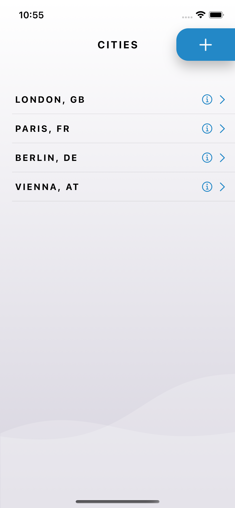

# weatherApp

## Table of Contents

- [Description](#description)
- [Screenshots](#screenshots)
- [Features](#features)
- [Installation](#installation)
- [Dependencies](#dependencies)
- [Service Holder](#service-holder)
- [UI](#ui)
- [Networking](#networking)
- [Contact](#contact)

## Description

WeatherApp is a simple iOS weather application that allows users to maintain a list of cities and retrieve both current and historical weather data for those cities. 

The app is built using the Swift programming language and leverages RXSwift to facilitate reactive programming. It follows the MVVM architecture pattern, ensuring a clean and organized codebase. The Coordinator pattern is utilized for navigation, making it easy to manage the flow between different screens. 

All libraries and frameworks used in the project are installed via CocoaPods.

## Screenshots

<p align="center">
  
  <br />
  <em>City Selector Screen (Light)</em>
</p>

<p align="center">
  
  <br />
  <em>City Selector Screen (Dark)</em>
</p>

<p align="center">
  
  <br />
  <em>Search Screen (Light)</em>
</p>

<p align="center">
  
  <br />
  <em>Search Screen (Dark)</em>
</p>

<p align="center">
  
  <br />
  <em>Details Screen (Light)</em>
</p>

<p align="center">
  
  <br />
  <em>Details Screen (Dark)</em>
</p>

<p align="center">
  
  <br />
  <em>History Screen (Light)</em>
</p>

<p align="center">
  
  <br />
  <em>History Screen</em>
</p>

## Features

- **Add Cities:** Users can add cities from their list.
- **Current Weather:** Display the current weather status including description, temperature (in Celsius), humidity, and wind speed for the selected city.
- **Historical Weather:** Save and display historical weather data for each city including previous requests' date and time.
- **Detailed Historical Data:** View historical weather data for a city by clicking on the detail disclosure button.

## Installation

To install and run weatherApp on your iOS device, please follow these steps:

1. Clone the repository to your local machine:

   ```bash
   $ git clone https://github.com/your-username/weatherApp.git

2. Navigate to the project directory:

   ```bash
   $ cd weatherApp

4. Install dependencies using CocoaPods:

   ```bash
   $ pod install
   
6. Open the Xcode workspace file:

   ```bash
   $ open weatherApp.xcworkspace
   
8. Build and run the project in Xcode.

## Dependencies

The following libraries and frameworks are used in NewYorkTimes:

- RxSwift: Reactive programming library for Swift.
- RxCocoa: Reactive extensions for UIKit and Cocoa.
- Moya: Network abstraction layer built on top of Alamofire for easy networking.
- Moya/RxSwift: Reactive extensions for Moya.
- Kingfisher: A lightweight and pure-Swift library for downloading and caching images from the web.
- SnapKit: A Swift autolayout DSL for iOS and macOS.
- CoreData: Framework for managing the model layer objects in the application.

All dependencies are managed using CocoaPods. To install the required dependencies, make sure you have CocoaPods installed and run the following command in your project directory:

```bash
$ pod install
```

## Service Holder

The app utilizes a service holder to manage various services in the app. The service holder provides a convenient and centralized way to handle different services and their dependencies. It abstracts away the implementation details, making it easier to manage and coordinate different services within the app.

## UI

The user interface (UI) of NewYorkTimes is created programmatically using SnapKit. SnapKit is a Swift autolayout DSL that allows you to define your UI constraints in a more expressive and concise way.

By using programmatic UI, the app provides flexibility and customization options for adapting to different device sizes and orientations. The UI components are created and configured in the corresponding view controllers, leveraging SnapKit to define their layout constraints.

## Networking

NewYorkTimes leverages the power of Moya and RxSwift for network requests. Moya is a network abstraction layer built on top of Alamofire, providing a convenient and type-safe way to make API requests. RxSwift integrates seamlessly with Moya, allowing you to handle network responses reactively.

The network layer is structured using the MVVM pattern, where view models make use of Moya to interact with the API and retrieve news articles via UseCase class. RxSwift enables the handling of asynchronous operations in a reactive manner, allowing for easy composition and chaining of network requests.

To configure the network layer, refer to the NetworkProvider class in the project. This is where Moya's Provider is set up with the necessary plugins, headers, and base URL for making network requests.

## Contact

If you have any questions, suggestions, or feedback, please feel free to reach out to me:

Email: alena.drobko.ios@gmail.com
